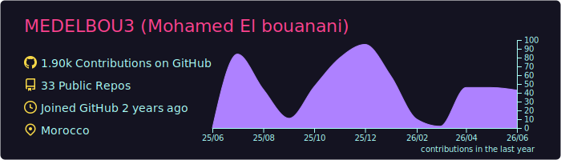
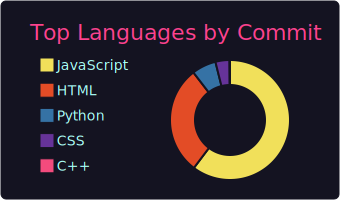
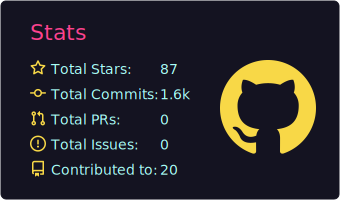
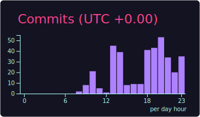

  

  

  
  
  
  

---

## 👨‍💻 About Me

Computer Science & AI Student , I am interested in programming, web development, and creating interactive digital projects. I enjoy working with JavaScript, HTML, and CSS to build applications related to music, movies, education, and 3D systems. I also like exploring algorithms, design, and user experience, and I often experiment with new ideas and technologies to improve my projects and develop my technical skills.

- 📫 Reach me at: **simo.elb.2005@gmail.com**

---

## 🛠️ Tech Stack

  

---

## 📊 GitHub Analytics

  
   
  
  
  
   
  
  
  

---

## 📈 GitHub Stats

# 🌍 My Dreams & Goals

---

## 🏎️ Drive a Formula 1 Car

  

One of my biggest dreams is to experience the speed and adrenaline of driving a Formula 1 car.  
I want to feel the power of the engine, hear the roar of the track, and live the atmosphere of professional racing.

> *"Speed is not just movement, it’s a feeling."*

---

## 🗾 Travel to Japan

  

I dream of traveling to Japan one day and discovering its incredible culture, technology, food, and beautiful landscapes.

### Places I Want To Visit
- Tokyo 🌆
- Kyoto ⛩️
- Osaka 🍜
- Mount Fuji 🗻

### Experiences I Want
- Japanese street food 🍣
- Anime & gaming culture 🎮
- Bullet trains 🚄
- Traditional temples and nature 🌸

---

## 🚀 My Future Vision

  

I want to build a successful future, create amazing projects, travel across the world, and continue learning new things every day.

---

---

## 🔥 Streak & Activity

  
    
  

---

## 🏆 GitHub Trophies

  

---

## 🎨 3D Contribution Graph

  

---

## 🐍 Contribution Snake

  <picture>
    <source media="(prefers-color-scheme: dark)" srcset="https://raw.githubusercontent.com/MEDELBOU3/MEDELBOU3/output/github-contribution-grid-snake-dark.svg">
    <source media="(prefers-color-scheme: light)" srcset="https://raw.githubusercontent.com/MEDELBOU3/MEDELBOU3/output/github-contribution-grid-snake.svg">
    
  </picture>

---

## 🚀 Featured Projects

  
  

 

  

---

## 🏅 Achievements

  
  
  

 

  <h3>🎵 Coding Vibes</h3>
  

---

## 💖 Support My Work

  
If you find my projects valuable, consider supporting my work:

  
  
  

---

## 🤝 Connect With Me

  
  
  

