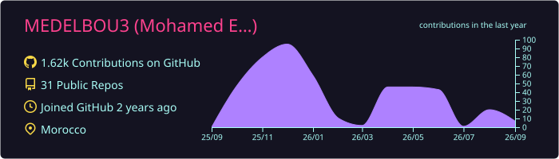
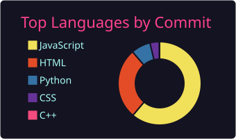
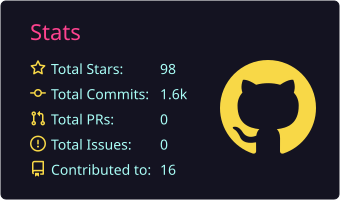
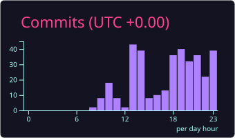

<div align="center">


<a href="https://git.io/typing-svg">
  
</a>

<br/>

<a href="https://medelbou3.github.io/My-portfolio/">
  
</a>
<a href="https://linkedin.com/in/elbou-simo-644820282">
  
</a>
<a href="https://x.com/Simo_Elbou3">
  
</a>
<a href="https://www.researchgate.net/profile/Mohamed-El-Bouanani-3">
  
</a>
<a href="https://www.kaggle.com/mohamedelbouanani">
  
</a>
<a href="mailto:simo.elb.2005@gmail.com">
  
</a>

</div>

---

## About Me

I am a **Computer Science & Artificial Intelligence student** interested in building software that combines **programming, AI, real-time graphics, interactive systems, and product design**.

I enjoy creating projects from the ground up and learning how complex systems work internally. My work ranges from web applications and algorithms to 3D tools, game-engine systems, animation workflows, rendering experiments, and AI-related research.

My current focus is on building **SM Engine**, a modular real-time 3D creation and game-development environment based on **Three.js, JavaScript, Electron, WebGL, and WebAssembly-oriented tooling**.

```text
Current interests
├── Artificial Intelligence & Machine Learning
├── Game Engine Architecture
├── Real-Time 3D Graphics
├── Rendering & Optimization
├── Animation Systems
├── Full-Stack Development
├── Algorithms & Research
└── UI / UX for complex creative tools
```

---

## What I Am Building

### SM Engine

<div align="center">
  <a href="https://github.com/MEDELBOU3/SM-Engine">
    
  </a>
</div>

**SM Engine** is my largest ongoing engineering project: a modular editor and runtime for real-time 3D creation, modeling, animation, gameplay systems, rendering, terrain, virtual production, scripting, build/export workflows, and extensibility.

Some areas I am actively exploring inside the project include:

- Editor and workspace architecture
- 3D modeling and sculpting tools
- Timeline, graph and animation systems
- Player / character architecture
- Physics and gameplay runtime
- AI and behavior systems
- Rendering and lighting
- Terrain and water
- 2D animation
- Plugin architecture
- Build and standalone export systems
- Performance optimization for larger scenes

<a href="https://github.com/MEDELBOU3/SM-Engine">
  
</a>

---

## Tech Stack

<div align="center">


</div>

### Main Areas

| Area | Technologies / Tools |
|---|---|
| **Languages** | JavaScript, Python, C++, C, HTML, CSS |
| **3D & Graphics** | Three.js, WebGL, GLSL concepts |
| **Desktop Apps** | Electron |
| **AI / Data** | Python, algorithm experimentation, ML concepts |
| **Web** | Front-end development, interactive web applications |
| **Tools** | Git, GitHub, VS Code, Figma |
| **Current Engineering Focus** | Engine architecture, animation, rendering, runtime systems, optimization |

---

## Featured Projects

<table>
<tr>
<td width="50%" valign="top">

### SM Engine

<a href="https://github.com/MEDELBOU3/SM-Engine">
  
</a>

Modular 3D creation and game-development engine focused on editor tooling, real-time graphics, animation, gameplay systems and extensibility.

**Tech:** JavaScript · Three.js · Electron · WebGL

</td>
<td width="50%" valign="top">

### AetherStream

<a href="https://github.com/MEDELBOU3/AetherStream">
  
</a>

A media-focused web application built around an interactive streaming-style interface and front-end experience.

**Tech:** HTML · CSS · JavaScript

</td>
</tr>
</table>

<div align="center">

<a href="https://github.com/MEDELBOU3?tab=repositories">
  
</a>

</div>

---

## Research & Technical Exploration

I am also interested in the research side of computer science, especially when an idea can be implemented, tested, measured, and compared experimentally.

My interests include:

- Algorithms and heuristics
- Optimization problems
- Artificial intelligence
- Real-time systems
- Rendering techniques
- Performance engineering
- Simulation
- Experimental software design

<div align="center">

<a href="https://www.researchgate.net/profile/Mohamed-El-Bouanani-3">
  
</a>
<a href="https://www.kaggle.com/mohamedelbouanani">
  
</a>

</div>

---

## GitHub Analytics

<div align="center">



<br/>




<br/>



</div>

---

## Contribution Activity

<div align="center">


<br/><br/>
</div>

---

## 3D Contribution Graph

<div align="center">
  
</div>

---

## Contribution Snake

<div align="center">

<picture>
  <source media="(prefers-color-scheme: dark)" srcset="https://raw.githubusercontent.com/MEDELBOU3/MEDELBOU3/output/github-contribution-grid-snake-dark.svg">
  <source media="(prefers-color-scheme: light)" srcset="https://raw.githubusercontent.com/MEDELBOU3/MEDELBOU3/output/github-contribution-grid-snake.svg">
  
</picture>

</div>

---

## Goals

I want to keep growing as an engineer and eventually work on ambitious technology products involving **AI, graphics, real-time systems, and creative software**.

Some long-term goals:

- Build software used by real people
- Grow SM Engine into a serious technical platform
- Work on advanced AI and graphics systems
- Publish stronger technical and research work
- Collaborate with talented developers around the world
- Build products and companies around meaningful technology
- Keep learning across computer science, design, and engineering

---

## Beyond Code

Technology is a major part of my life, but not the only thing I want to experience.

### Formula 1

<div align="center">
  
</div>

One of my personal dreams is to experience a Formula 1 car and the engineering, precision, and speed behind motorsport.

### Japan

<div align="center">
  
</div>

Japan is one of the countries I would most like to explore for its technology, cities, culture, food, design, transportation, and landscapes.

Places I would like to visit include **Tokyo, Kyoto, Osaka, and Mount Fuji**.

---

## Connect With Me

<div align="center">

<a href="https://medelbou3.github.io/My-portfolio/">
  
</a>
<a href="https://linkedin.com/in/elbou-simo-644820282">
  
</a>
<a href="https://x.com/Simo_Elbou3">
  
</a>
<a href="https://www.researchgate.net/profile/Mohamed-El-Bouanani-3">
  
</a>
<a href="https://www.kaggle.com/mohamedelbouanani">
  
</a>
<a href="mailto:simo.elb.2005@gmail.com">
  
</a>

</div>

---

## Support

<div align="center">

If you enjoy my open-source work, starring a repository or sharing feedback is already a great way to support it.

<br/><br/>

<a href="https://www.buymeacoffee.com/simolbou3">
  
</a>
<a href="https://paypal.me/simolbou3">
  
</a>
<a href="https://github.com/sponsors/MEDELBOU3">
  
</a>

</div>

---

<div align="center">

### Thanks for visiting

**I like building difficult things, understanding how they work, and improving them one system at a time.**


</div>
